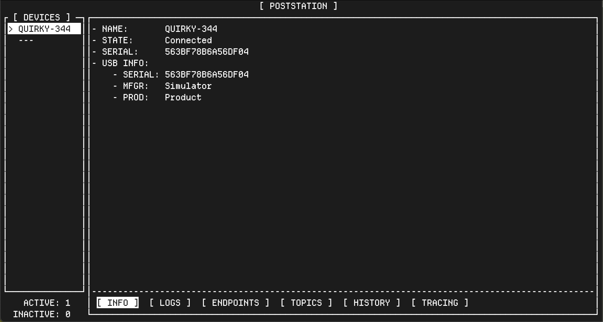

# Starting Simulated Devices

We'll need to start poststation with simulated devices for this step. This
will create virtual devices we can interact with, before we are ready to
use real external devices.

If the poststation server is running, you will need to stop it first. We'll
then launch it with the `--simulator-devices=1` flag as shown below, to start
a single simulator device.

Poststation will "reuse" simulator devices, so if you exit and restart
poststation, the same simulator devices will re-appear.

```sh
$ poststation --simulator-devices=1
```

If this is the first time you have run poststation, you will need to enter your
license key, or press "escape" to continue. You should see a screen similar to
this:



We'll look at the information presented on this menu in the next section.
