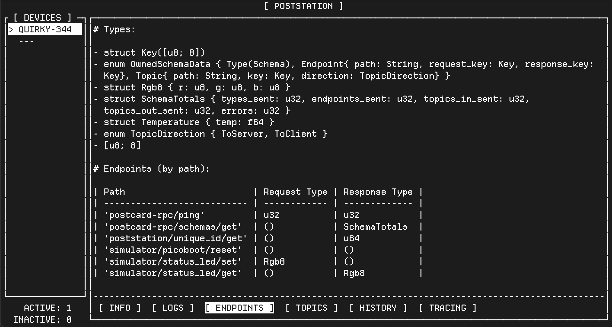

# The Poststation User Interface

This section explores the Poststation "Text User Interface", or TUI.

You saw this screen when we launched poststation:


This screen contains some important information:

## The `[ DEVICES ]` pane

A list of known devices is shown in the leftmost pane. Devices are divided by
whether they are currently connected or not. Connected devices are shown above
the `---` divider, and disconnected devices are shown below.

We can see that we have one connected device, called "QUIRKY-344". This name
is a shortened, human readable version of the device's **serial number**. We use
the [`twoten`](https://docs.rs/twoten/latest/twoten/) crate to generate these
names from the serial number of the device.

We can also see a summary of devices below the `[ DEVICES ]` pane, showing
that we have one ACTIVE (or connected) device, and zero INACTIVE (or
disconnected) devices.

## The main pane

To the right of the `[ DEVICES ]` pane, we have the main pane. The main pane
starts with the `[ INFO ]` page selected, which is highlighted at the bottom
of the pane.

These pages can be navigated by using the **left** and **right arrow keys**.

### The `[ INFO ]` page

This page shows some basic metadata about the device, including it's generated
short name, as well as the SERIAL number of the device. Poststation uses a
64-bit SERIAL number as a globally unique ID. You'll need this when you want
to interact with this device.

### The `[ LOGS ]` page

You can move from the `[ INFO ]` page to the `[ LOGS ]` page by pressing the
right arrow key. You should see a page that looks like this:


This page shows all logs from the device. The simulator will send a log
message once per second with the same text. You can see the logs scrolling
upwards as new logs are received.

### The `[ ENDPOINTS ]` page

You can move from the `[ LOGS ]` page to the `[ ENDPOINTS ]` page by
pressing the right arrow key. You should see a page that looks like this:



Endpoints are the main way that we will interact with a connected device.
Endpoints are made up of a "request", sent from a client to a server, and
a "response", which is sent from the server to the client.

Poststation will automatically communicate with the connected device to
determine what endpoints it offers, and the types used for each of those
endpoints. This process is called **Schema Discovery**. This occurs any
time that poststation connects to the device, which means that if it changes
as you are developing, poststation will always update this information.

Endpoints also have a "path", a human readable string that is used to identify
them.

The Endpoints page is broken into two parts, the **Types** section, and the
**Endpoints** section. We'll start with the bottom section.

#### The "Endpoints (by path)" section

The current page shows that the simulator device supports six endpoints.

The first endpoint, `postcard-rpc/ping` is an endpoint built in to all
postcard-rpc devices. This endpoint takes a `u32`, or 32-bit unsigned
integer, and also returns a `u32`. This endpoint will always "echo" back
the received value, and is often used to ensure the connection is working
correctly.

The second endpoint, `postcard-rpc/schemas/get`, is used for the **Schema
Discovery** process described above, and will trigger the device to send
information about itself. This is handled automatically by poststation.

The third endpoint, `poststation/unique_id/get` is used to obtain the
**serial number** of the device. We can see that this endpoint takes
no data, or `()` as the request parameter, and returns a `u64`, or a
64-bit unsigned integer as a response.

The fourth endpoint, `simulator/picoboot/reset` mimics the "reset to
bootloader" command used on physical RP2040 devices. In the simulator,
calling this endpoint will cause the simulator device to disconnect,
as if it was told to reboot into a bootloader that does not talk with
poststation. If you call this and would like the device to come back,
you will need to exit and restart poststation.

The fifth endpoint, `simulator/status_led/set`, takes an `Rgb8` value,
which can be used to set a red, green, and blue value, mimicing a device
that has an attached color LED. We can see that this endpoint does not
return any data, though we will still get an "empty" response from the
device as a confirmation.

The sixth endpoint, `simulator/status_led/get`, takes no data, but returns
the currently set value. In the simulator, this starts with all zero values,
and will retain the last value set by the `simulator/status_led/set` endpoint.

We can see some more information about the types mentioned in these endpoints
in the section above.

#### The "Types" section

This section shows the reported schema of all endpoints. If we see a type
like `Rgb8` in the "Endpoints" table, we can refer to the "Types" section
to see more.

For example, the `Rgb8` type is reported as:

```
struct Rgb8 { r: u8, g: u8, b: u8 }
```

This means we can provide a one byte value (0-255) for each color "r", "g",
and "b".

### The `[ TOPICS ]` page

You can move from the `[ ENDPOINTS ]` page to the `[ TOPICS ]` page by
pressing the right arrow key. You should see a page that looks like this:


Topics are the other way that we communicate with devices through
Poststation. While Endpoints always consist of a Request and Response,
Topics are messages that can be sent either client to server, or server to
client at any time, but do not have a response.

The client or server can "publish" a topic message, and the other device
will "subscribe" to topic messages.

Topics also have a human readable "path", but only have a single type
associated with them.

> NOTE: As of poststation v0.14, the `[ TOPICS ]` page ONLY shows "topics out",
> or topics from server to client. In the future, it will also show "topics in",
> or topics from the client to server.

We can see that our simulator device has three topics.

The first is `postcard-rpc/schema/data`, which is used as part of the
**Schema Discovery** process. This is handled automatically by Poststation.

The second is `postcard-rpc/logging`. This topic is used to fill in the
data on the `[ LOGS ]` page, and contains text data, or a `String`.

The third is `simulator/temperature`, which the simulator will publish
data to. If we look at the "Types" table, we can see that the `Temperature`
type contains the following data:

```
struct Temperature { temp: f64 }
```

Meaning that this temperature will be sent as a 64-bit floating point value

### The `[ HISTORY ]` page

This page shows a history of all messages (excluding LOGS) sent TO or FROM
the device. This can be used to monitor communication between clients and
servers.

It should currently look something like this:


Each line is broken up into four main parts:

First is the timestamp, which is shown in local time, for example
`13:52:38.097`.

Second is the "kind" of message, as well as the direction. This can be:

* `<-T` - or a "**T**opic" message sent TO the client FROM the server
* `T->` - or a "**T**opic" message sent TO the server FROM the client
* `E->` - or an "**E**ndpoint" Request sent TO the server FROM the client
* `<-E` - or an "**E**ndpoint" Response sent TO the client FROM the server

As we are not currently interacting with the device, we only see topic
messages sent from server to client.

### The `[ TRACING ]` page

This page shows the [`tracing`](https://docs.rs/tracing/latest/tracing/)
logs of poststation itself. This is not specific to the currently connected
device, and is the same information you would see on the command line if
you ran poststation with the `--headless` mode enabled.

> NOTE: This page is likely to be moved in the future, likely behind
> a separate diagnostics menu. It is here mostly as a development artifact
> of poststation.

This page should look like this:


