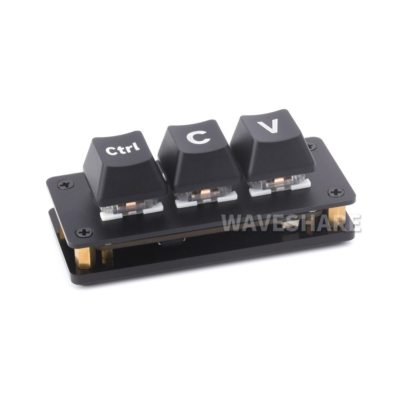

# Examples

This folder contains reference projects that can be used to see how to
work with Poststation. These examples are tested by CI, so should always
be up to date.

## `waveshare-rp2040-keyboard-3`



This project is a simple demo for the [Waveshare RP2040 Keyboard-3](https://www.waveshare.com/rp2040-keyboard-3.htm),
a simple RP2040-based three-key keyboard with RGB LEDs.

This example contains:

* `rp2040/` - a firmware project for the device
* `rp2040/scripts` - some BASH scripts used for testing
* `icd/` - the wire types used for this project
* `demo/` - a desktop app that demonstrates waiting for button presses and setting LED colors

### Setting up

To flash the device the first time, you will need to disassemble the case
(the screws are underneath the rubber feet), to gain access to the `BOOT`
button. Hold down this button and press reset (or hold while inserting
the USB cable) to put the device into the bootloader.

You can then flash the device by running `cargo run --release` in the
`rp2040` folder. This requires having [`picotool`](https://github.com/raspberrypi/picotool)
installed.

For subsequent updates, you can use the script `rp2040/scripts/picoboot.sh` to
place the device in bootloader mode (using Poststation), and then updating the
firmware. You will need to update the `SERIAL` variable based on the serial number
of your device. This can be found using the `poststation-cli ls` command, e.g.:

```sh
$ poststation-cli ls

# Devices

| serial           | name       | interface | connected |
| :--------------- | ---------: | :-------- | :-------- |
| E66350865F164926 | DAPHNE-153 | usb       | yes       |
  ^^^^^^^^^^^^^^^^
```
